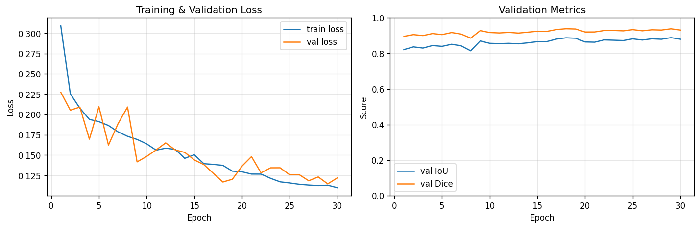

# Cloud Coverage Detection

Binary cloud/sky segmentation pipeline built on [segmentation-models-pytorch](https://github.com/qubvel/segmentation_models.pytorch). Fine-tunes an encoder-decoder model (default: DeepLabV3+ with EfficientNet-B0) on a sky-image dataset, then estimates cloud coverage percentage on new images.

## Setup

Install PyTorch for your platform from [pytorch.org](https://pytorch.org/get-started/locally/), then install the remaining dependencies:

```bash
pip install -r requirements.txt
```

## Dataset

The pipeline expects the [SWIMSEG](https://paperswithcode.com/dataset/swimseg) sky-image layout:

```
dataset/
    train/              # 861 training images   (.png)
    train_labels/       # 861 training masks    (.png)
    val/                # 101 validation images (.png)
    val_labels/         # 101 validation masks  (.png)
    test/               #  51 test images       (.png)
    test_labels/        #  51 test masks        (.png)
    class_dict.csv
```

**Mask convention:** `black (0, 0, 0)` = cloud (label 1) · `white (255, 255, 255)` = sky (label 0)

Image and mask filenames share the same stem (`0001.png` ↔ `0001.png`).

### Custom datasets

Override the default sub-directory names via flags:

```bash
python train.py --data_dir /path/to/data \
                --train_subdir images \
                --masks_subdir masks \
                --val_subdir val_images \
                --val_labels_subdir val_masks
```

If `--val_subdir` does not exist, a random split is created from the training set (controlled by `--val_ratio`, default 0.2).

If your masks use the opposite convention (white = cloud), flip the binarisation line in `train.py` inside `CloudDataset.__getitem__`:

```python
# black = cloud (default):
mask = (mask < 128).astype(np.float32)

# white = cloud:
mask = (mask > 127).astype(np.float32)
```

## Training

```bash
python train.py --data_dir ../dataset --epochs 30 --batch_size 8
```

| Flag | Default | Description |
|---|---|---|
| `--data_dir` | *(required)* | Root dataset directory |
| `--train_subdir` | `train` | Sub-folder with training images |
| `--masks_subdir` | `train_labels` | Sub-folder with training masks |
| `--val_subdir` | `val` | Sub-folder with validation images |
| `--val_labels_subdir` | `val_labels` | Sub-folder with validation masks |
| `--epochs` | `30` | Number of training epochs |
| `--batch_size` | `8` | Batch size |
| `--image_size` | `384` | Input resolution (square) |
| `--lr` | `1e-4` | Learning rate |
| `--val_ratio` | `0.2` | Val fraction when no val split is found |
| `--output_dir` | `./checkpoints` | Where to save checkpoints |
| `--device` | auto | `cuda` / `mps` / `cpu` |

Checkpoints are written to:
- `checkpoints/best_model.pth` — best validation IoU
- `checkpoints/final_model.pth` — last epoch

### Switching architecture

Edit `MODEL_CONFIG` at the top of [train.py](train.py):

```python
MODEL_CONFIG = {
    "architecture":    "DeepLabV3Plus",   # Unet | UnetPlusPlus | FPN | Linknet
    "encoder_name":    "efficientnet-b0", # resnet50 | mobilenet_v2 | ...
    "encoder_weights": "imagenet",
}
```

## Inference

### Single image

```bash
python predict.py --checkpoint checkpoints/best_model.pth --input photo.jpg
```

### Directory (inference only)

```bash
python predict.py --checkpoint checkpoints/best_model.pth \
                  --input ../dataset/test \
                  --output_dir ./predictions
```

### Directory with evaluation (ground-truth masks)

```bash
python predict.py --checkpoint checkpoints/best_model.pth \
                  --input ../dataset/test \
                  --labels_dir ../dataset/test_labels \
                  --output_dir ./predictions
```

When `--labels_dir` is provided, per-image IoU and Dice scores are computed, included in the CSV report, and summarised at the end.

| Flag | Default | Description |
|---|---|---|
| `--checkpoint` | *(required)* | Path to `.pth` checkpoint |
| `--input` | *(required)* | Image file or directory |
| `--labels_dir` | — | Ground-truth mask directory for evaluation |
| `--output_dir` | `./predictions` | Where to save results |
| `--threshold` | `0.5` | Probability threshold for cloud pixels |
| `--no_overlay` | off | Skip saving overlay visualisations |
| `--no_mask` | off | Skip saving raw binary mask PNGs |
| `--device` | auto | `cuda` / `mps` / `cpu` |

### Output structure

```
predictions/
├── masks/
│   └── 0913_mask.png       # binary mask — 0 = sky, 255 = cloud
├── overlays/
│   └── 0913_overlay.jpg    # original image with red cloud overlay
└── coverage_report.csv     # per-image coverage % (+ IoU/Dice if --labels_dir given)
```

## Results

### Training curves



### Sample predictions (input image · predicted mask)

Each pair shows the original sky photo on the left and the predicted binary mask on the right (black = cloud, white = sky).

**~20 % coverage**

[alt text](predictions/overlays/0914_viz.jpg)

**~34 % coverage**

[alt text](predictions/overlays/0916_viz.jpg)

**~62 % coverage**

[alt text](predictions/overlays/0970_viz.jpg)

**~86 % coverage**

[alt text](predictions/overlays/0957_viz.jpg)

**~100 % coverage**

[alt text](predictions/overlays/0963_viz.jpg)
